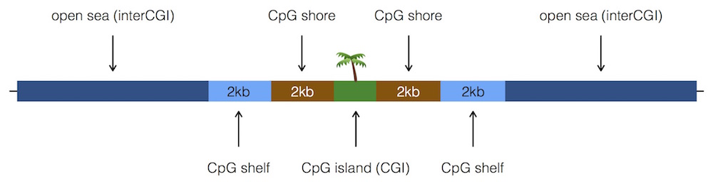
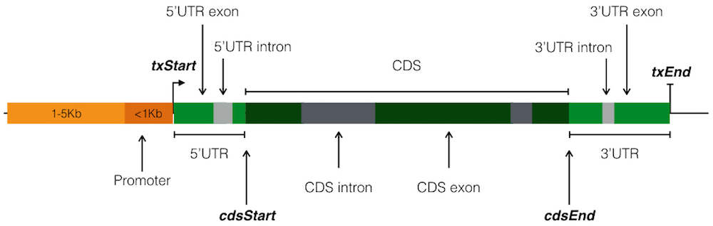

# Introduction

Genomic regions resulting from next-generation sequencing experiments and bioinformatics pipelines are more meaningful when annotated to genomic features. A SNP occurring in an exon, or an enhancer, is likely of greater interest than one occurring in an inter-genic region. It may be of interest to find that a particular transcription factor overwhelmingly binds in promoters, while another binds mostly in 3’UTRs. Hyper-methylation at promoters containing a CpG island may indicate different regulatory regimes in one condition compared to another.

`annotatr` provides *pre-built* genomic annotations and a set of functions to read, intersect, summarize, and visualize genomic regions in the context of genomic annotations.

# Installation

`annotatr` package source is available at [http://www.github.com/rcavalcante/annotatr](http://www.github.com/rcavalcante/annotatr). The package can be installed directly from GitHub with the [`devtools`](https://cran.r-project.org/web/packages/devtools/index.html) package.

```{r, eval=FALSE}
# Install BiocStyle, GenomeInfoDb, IRanges, and GenomicRanges first
# install_github() does not support installation of Bioconductor dependencies
source("https://bioconductor.org/biocLite.R")
biocLite(c("BiocStyle","GenomeInfoDb","IRanges","GenomicRanges"))

devtools::install_github('rcavalcante/annotatr')
```

```{r, echo=FALSE}
suppressWarnings(suppressMessages(suppressPackageStartupMessages(devtools::load_all())))
```

# Annotations

We provide a number of pre-built annotations for human (hg19 and hg38) and mouse (mm9 and mm10) genomes. The `supported_annotations()` function lists pre-built annotations. Custom annotations are also supported via the `read_annotations()` function.

## CpG Annotations

The base CpG island (CGI) track from the UCSC Genome Browser serves as our CpG island annotations. CpG shores are defined as 2Kb upstream/downstream from the ends of the CpG islands, less the CpG islands. CpG shelves are defined as another 2Kb upstream/downstream of the farthest upstream/downstream limits of the CpG shores, less the CpG islands and CpG shores. The remaining genomic regions make up the inter-CGI annotation.



## UCSC knownGenes

The UCSC knownGenes tracks were downloaded from the UCSC Genome Browser. KnownGenes annotations include 1-5Kb upstream of the TSS, the promoter (<1Kb upstream of the TSS), 5'UTR, first exons, exons, first introns, introns, CDS, 3'UTR, and 5'UTR exons, 5'UTR introns, 3'UTR exons, 3'UTR introns, and intergenic regions (the intergenic regions exclude the previous list of annotations in addition to the gap segments of each supported genome). The schematic below gives an idea of how the location coordinates in the knownGene files are used to determine the annotations.



## FANTOM5 Permissive Enhancers

FANTOM5 permissive enhancers were determined from bi-directional CAGE transcription as in [Andersson et al. (2014)](http://www.nature.com/nature/journal/v507/n7493/full/nature12787.html), and downloaded from the [PrESSTo Human Enhancers](http://enhancer.binf.ku.dk/presets/) resource. The enhancers occur across multiple cell types and are with respect to the hg19 genome only.

## Custom Annotations

Users may also load their own annotations using the `read_annotations()` function. Annotations must be tab-delimited files with 3 (chrom, start, end), 4 (+ annotation name), or 5 (+ strand) columns. Custom annotations for `supported_genomes()` can be used in conjunction with built-in annotations. If a genome is not supported, users may provide as many custom annotations as they like.

```{r}
# Use ENCODE ChIP-seq peaks for EZH2 in GM12878 as annotations
# This file contains only chrom, start, and end columns
ezh2_file = system.file('extdata', 'Gm12878_Ezh2_peak_annotations.txt.gz', package = 'annotatr')

# Custom annotation objects should have names of the form genome_custom_name
hg19_custom_ezh2 = read_annotations(
  file = ezh2_file,
  genome = 'hg19',
  annotation_name = 'ezh2'
  )
print(hg19_custom_ezh2)
```

# Usage

The following example is based on the results of testing for differential methylation of genomic regions between two conditions using [methylSig](https://github.com/sartorlab/methylSig). The file (`inst/extdata/IDH2mut_v_NBM_multi_data_chr9.txt.gz`) contains chromosome locations, as well as categorical and numerical data columns, and provides a good example of the flexibility of `annotatr`.

## Reading Genomic Regions

`annotatr` reads in genomic regions of interest as [BED6](https://genome.ucsc.edu/FAQ/FAQformat.html#format1) files using the `read_bed()` and `read_df()` functions. The `name` and `score` columns specified in the BED specification can be used to store categorical and numerical data, respectively. Additional data columns can be provided in columns 7 and above.

`read_bed()` requires the `file` path to be read, a `genome` (e.g., hg19, hg38, mm9, or mm10), a logical value indicating whether the data is `stranded`, and a logical value indicating whether the `score` column should be used. The `col.names` parameter can either be a character vector of the column names, `TRUE` to indicate that the file contains a header row, or `FALSE` to indicate neither. See [readr::read_tsv](https://cran.r-project.org/web/packages/readr/readr.pdf) documentation for details on this parameter.

`read_df()` takes a `data.frame` that exists in the current workspace and converts it into a `GenomicRanges` object for annotation. The restrictions on the `data.frame` are the same as on the file used in `read_bed()`.

```{r}
# This file in inst/extdata represents regions tested for differential
# methylation between two conditions. Additionally, there are columns
# reporting the p-value on the test for differential meth., the
# meth. difference between the two groups, and the group meth. rates.
dm_file = system.file(
  'extdata',
  'IDH2mut_v_NBM_multi_data_chr9.txt.gz',
  package='annotatr')
dm_regions = read_bed(
  file = dm_file,
  col.names= c(
    'chr','start','end','DM_status','pval',
    'strand','diff_meth','mu1','mu0'),
  genome = 'hg19',
  stranded = FALSE,
  use.score = TRUE)
print(dm_regions)
```

## Annotating Regions

Users may select annotations a la carte via the accessors listed with `supported_annotations()`, or via shortcuts. The `hg19_cpgs` shortcut annotates regions to CpG islands, CpG shores, CpG shelves, and inter-CGI. The `hg19_basicgenes` shortcut annotates regions to 1-5Kb, promoters, 5'UTRs, exons, introns, and 3'UTRs. The `hg19_detailedgenes` shortcut annotates regions to 1-5Kb, promoters, 5'UTR exons, 5'UTR introns, CDS exons, CDS introns, 3'UTR exons, and 3'UTR introns. The `hg19_basicgenes` and `hg19_detailedgenes` shortcuts may not be used at the same time. Shortcuts for other `supported_genomes()` are accessed in the same way, replacing `hg19` with one of `hg38`, `mm9`, or `mm10`.

`annotate_regions()` requires a `GRanges` object (either the result of `read_bed()` or an existing object), a character vector indicating the `annotations` to annotate the regions with, a logical value indicating whether to `ignore.strand` when calling `GenomicRanges::findOverlaps()`, and a logical value indicating whether to `use.score`.

```{r}

# Select annotations for intersection with regions
# Note inclusion of custom annotation, and use of shortcuts
annots = c('hg19_cpgs', 'hg19_basicgenes', 'hg19_knownGenes_intergenic',
  'hg19_enhancers_fantom', 'hg19_knownGenes_firstexons',
  'hg19_knownGenes_firstintrons', 'hg19_custom_ezh2')
# Intersect the regions we read in with the annotations
dm_annotated = annotate_regions(
  regions = dm_regions,
  annotations = annots,
  ignore.strand = TRUE,
  use.score = TRUE)
# A dplyr::tbl_df object is returned
# NOTE: tbl_df has a special print method that displays
# a tidy version of the tbl_df, variables not shown are listed below.
print(dm_annotated)
```

## Summarizing Over Annotations

The three summarization functions -- `summarize_annotations()`, `summarize_numerical()`, and `summarize_categorical()` -- all take the `dplyr::tbl_df` objects output from `annotate_regions()` as their input, and output either a `dplyr::tbl_df` (for `summarize_annotations()`) or `dplyr::grouped_df` (for the others).

```{r, eval=FALSE}
# Usage of summarize functions with defaults
summarize_annotations(annotated_regions)

summarize_numerical(
  annotated_regions,
  by = c("annot_type", "annot_id"),
  over = "score")

summarize_categorical(
  annotated_regions,
  by = c("annot_type", "annot_id"))
```

When there is no categorical (`name` column) or numerical (`score` column) information associated with the regions, `summarize_annotations()` is the only possible function to use. It gives the counts of regions in each annotation type (see example below). If there is categorical and/or numerical information, then `summarize_numerical()` and/or `summarize_categorical()` may be used.

```{r}
# Find the number of regions per annotation type
dm_annsum = summarize_annotations(annotated_regions = dm_annotated)
print(dm_annsum)

# Take the mean of the diff_meth column across all regions
# occurring in an annotation.
dm_numsum = summarize_numerical(
  annotated_regions = dm_annotated,
  by = c('annot_type', 'annot_id'),
  over = c('diff_meth'))
print(dm_numsum)

# Count the occurrences of classifications in the DM_status
# column across the annotation types.
dm_catsum = summarize_categorical(
  annotated_regions = dm_annotated,
  by = c('annot_type', 'DM_status'))
print(dm_catsum)
```

## Visualizing

`annotatr` has 5 visualization functions (`visualize_annotation()`, `visualize_coannotations()`, `visualize_numerical()`, `visualize_numerical_coannotations()`, and `visualize_categorical()`) to be used on the object returned by `annotate_regions()`. The visualization functions return an object of type `ggplot` that can be viewed (`print`) and saved (`ggsave`).

```{r, eval=FALSE}
# Usage of visualization functions with defaults

visualize_annotation(annotated_regions, annotation_order = NULL,
  plot_title = NULL, x_label = NULL, y_label = NULL)

visualize_coannotations(annotated_regions, annotation_order = NULL,
  plot_title = NULL, axes_label = NULL)

visualize_numerical(tbl, x, y = NULL, facet = "annot_type",
  facet_order = NULL, bin_width = 10, plot_title = NULL, x_label = NULL,
  y_label = NULL)

visualize_numerical_coannotations(tbl, x, y = NULL, annot1, annot2,
  bin_width = 10, plot_title = NULL, x_label = NULL, y_label = NULL)

visualize_categorical(annotated_regions, x, fill = NULL, x_order = NULL,
  fill_order = NULL, position = "stack", plot_title = NULL,
  legend_title = NULL, x_label = NULL, y_label = NULL)
```

### Visualizing Regions per Annotation

```{r, fig.align='center', fig.cap='Number of DM regions per annotation.', fig.height=5, fig.width=5, fig.show = 'hold'}
# View the number of regions per annotation. This function
# is useful when there is no classification or data
# associated with the regions.
annots_order = c(
  'hg19_custom_ezh2',
  'hg19_enhancers_fantom',
  'hg19_knownGenes_1to5kb',
  'hg19_knownGenes_promoters',
  'hg19_knownGenes_5UTRs',
  'hg19_knownGenes_firstexons',
  'hg19_knownGenes_exons',
  'hg19_knownGenes_firstintrons',
  'hg19_knownGenes_introns',
  'hg19_knownGenes_3UTRs',
  'hg19_knownGenes_intergenic')
dm_vs_kg_annotations = visualize_annotation(
  annotated_regions = dm_annotated,
  annotation_order = annots_order,
  plot_title = 'Number of Sites Tested for DM annotated on chr9',
  x_label = 'knownGene Annotations',
  y_label = 'Count')
print(dm_vs_kg_annotations)
```

### Visualizing Regions Occurring in Pairs of Annotations

```{r, fig.align='center', fig.cap='Number of DM regions per pair of annotations.', fig.height=7, fig.width=7, fig.show = 'hold'}
# View a heatmap of regions occurring in pairs of annotations
annots_order = c(
  'hg19_custom_ezh2',
  'hg19_enhancers_fantom',
  'hg19_knownGenes_1to5kb',
  'hg19_knownGenes_promoters',
  'hg19_knownGenes_5UTRs',
  'hg19_knownGenes_firstexons',
  'hg19_knownGenes_exons',
  'hg19_knownGenes_firstintrons',
  'hg19_knownGenes_introns',
  'hg19_knownGenes_3UTRs',
  'hg19_knownGenes_intergenic')
dm_vs_coannotations = visualize_coannotations(
  annotated_regions = dm_annotated,
  annotation_order = annots_order,
  axes_label = 'Annotations',
  plot_title = 'Regions in Pairs of Annotations')
print(dm_vs_coannotations)
```

### Visualizing Numerical Data Over Regions

With numerical data, the `visualize_numerical()` function allows for the plotting of a single variable (histogram) or of two variables (scatterplot) at the region level, faceting over the annotations. Note, when the plot is a histogram, the background distribution (red overlay histogram is the distribution of the quantity among all annotations used in `annotate_regions()`) is plotted within each facet.

```{r, fig.align='center', fig.cap='Methylation Rates in Regions Over Gene Features in Control Group.', fig.height=6, fig.width=8, fig.show='hold'}
dm_vs_regions_annot = visualize_numerical(
  tbl = dm_annotated,
  x = 'mu0',
  facet = 'annot_type',
  facet_order = c('hg19_knownGenes_1to5kb','hg19_knownGenes_promoters',
    'hg19_knownGenes_5UTRs','hg19_knownGenes_3UTRs', 'hg19_custom_ezh2',
    'hg19_knownGenes_intergenic'),
  bin_width = 5,
  plot_title = 'Group 0 Region Methylation In Genes',
  x_label = 'Group 0')
print(dm_vs_regions_annot)
```

```{r, fig.align='center', fig.cap='Methylation Rates in Regions Over DM Status in Group 0 vs Group 1.', fig.height=3, fig.width=8, fig.show='hold'}
dm_vs_regions_name = visualize_numerical(
  tbl = dm_annotated,
  x = 'mu0',
  y = 'mu1',
  facet = 'DM_status',
  facet_order = c('hyper','hypo','none'),
  plot_title = 'Region Methylation: Group 0 vs Group 1',
  x_label = 'Group 0',
  y_label = 'Group 1')
print(dm_vs_regions_name)
```

It is also possible to visualize joint and marginal distributions of numerical data with respect to annotation type with `visualize_numerical_coannotations()`. For example, the following example shows CpG methylation rates for CpGs occurring in just promoters, just CpG islands, and both promoters and CpG islands.

```{r, fig.align='center', fig.cap='Group 0 methylation Rates in Regions in promoters, CpG islands, and both.', fig.height=7, fig.width=7, fig.show='hold'}
dm_vs_num_co = visualize_numerical_coannotations(
  tbl = dm_annotated,
  x = 'mu0',
  annot1 = 'hg19_cpg_islands',
  annot2 = 'hg19_knownGenes_promoters',
  bin_width = 5,
  plot_title = 'Group 0 Perc. Meth. in CpG Islands and Promoters',
  x_label = 'Percent Methylation')
print(dm_vs_num_co)
```

### Visualizing Summarized Numerical Data

```{r, fig.align='center', fig.cap='Methylation difference distributions across the CpG annotations.', fig.height=6, fig.width=6, fig.show = 'hold'}
# View the methylation differences summarized over the CpG annotations
# NOTE: Background distribution is plotted in each facet.

# A subset of cpgs_order could be chosen to display
# the data distribution only in those annotations.
cpgs_order = c(
  'hg19_cpg_islands',
  'hg19_cpg_shores',
  'hg19_cpg_shelves',
  'hg19_cpg_inter')
dm_vs_cpg_num = visualize_numerical(
  tbl = dm_numsum,
  x = 'mean',
  facet = 'annot_type',
  facet_order = cpgs_order,
  bin_width = 5,
  plot_title = 'Group Meth. Diffs. Across CpG Annotations',
  x_label = 'Mean Diff. in Meth. Over Annotations')
print(dm_vs_cpg_num)
```

### Visualizing Categorical Data

```{r, fig.align='center', fig.cap='Differential methylation classification with counts of CpG annotations.', fig.height=6, fig.width=6, fig.show='hold'}
# View the counts of CpG annotations in data classes

# The orders for the x-axis labels. This is also a subset
# of the labels (hyper, hypo, none).
x_order = c(
  'hyper',
  'hypo')
# The orders for the fill labels. Can also use this
# parameter to subset annotation types to fill.
fill_order = c(
  'hg19_cpg_islands',
  'hg19_cpg_shores',
  'hg19_cpg_shelves',
  'hg19_cpg_inter')
# Make a barplot of the data class where each bar
# is composed of the counts of CpG annotations.
dm_vs_cpg_cat1 = visualize_categorical(
  annotated_regions = dm_annotated, x='DM_status', fill='annot_type',
  x_order = x_order, fill_order = fill_order, position='stack',
  plot_title = 'DM Status by CpG Annotation Counts',
  legend_title = 'Annotations',
  x_label = 'DM status',
  y_label = 'Count')
print(dm_vs_cpg_cat1)
```

```{r, fig.align='center', fig.cap='Differential methylation classification with proportion of CpG annotations.', fig.height=6, fig.width=6, fig.show='hold'}
# Use the same order vectors as the previous code block,
# but use proportional fill instead of counts.

# Make a barplot of the data class where each bar
# is composed of the *proportion* of CpG annotations.
dm_vs_cpg_cat2 = visualize_categorical(
  annotated_regions = dm_annotated, x='DM_status', fill='annot_type',
  x_order = x_order, fill_order = fill_order, position='fill',
  plot_title = 'DM Status by CpG Annotation Proportions',
  legend_title = 'Annotations',
  x_label = 'DM status',
  y_label = 'Proportion')
print(dm_vs_cpg_cat2)
```

```{r, fig.align='center', fig.cap='Basic gene annotations with proportions of DM classification.', fig.height=6, fig.width=6, fig.show='hold'}
# View the proportions of data classes in knownGene annotations

# The orders for the x-axis labels.
x_order = c(
  'hg19_custom_ezh2',
  'hg19_enhancers_fantom',
  'hg19_knownGenes_1to5kb',
  'hg19_knownGenes_promoters',
  'hg19_knownGenes_5UTRs',
  'hg19_knownGenes_exons',
  'hg19_knownGenes_introns',
  'hg19_knownGenes_3UTRs',
  'hg19_knownGenes_intergenic')
# The orders for the fill labels.
fill_order = c(
  'hyper',
  'hypo',
  'none')
dm_vs_kg_cat = visualize_categorical(
  annotated_regions = dm_annotated, x='annot_type', fill='DM_status',
  x_order = x_order, fill_order = fill_order, position='fill',
  legend_title = 'DM Status',
  x_label = 'knownGene Annotations',
  y_label = 'Proportion')
print(dm_vs_kg_cat)
```
